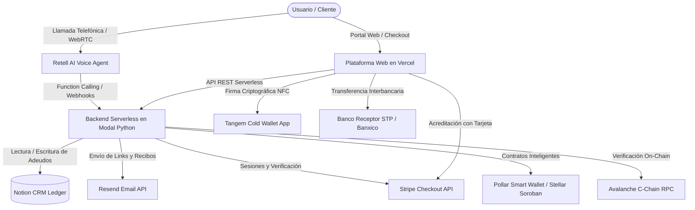

# 🚀 GoyaPay AI — Asistente Autónomo de Voz, Finanzas Web3 & Business Manager

**GoyaPay AI** es una plataforma integral de finanzas, liquidación de adeudos y cobros asistida por Inteligencia Artificial conversacional de voz en tiempo real. Diseñada para eliminar la fricción en la gestión y liquidación de adeudos (universitarios, trámites y negocios), integra infraestructura multicadena Web3 de última generación (**Avalanche C-Chain**, **Pollar Smart Wallet en Stellar Soroban** y hardware criptográfico **Tangem Cold Wallet NFC**), pasarelas bancarias tradicionales (**Stripe Checkout Oficial** y **SPEI Banxico**), y análisis financiero automatizado con **Notion CRM**.

---

## 🌟 Pilares y Capacidades Principales

1. **🎙️ Agente Autónomo de Voz 24/7 (Retell AI + Cartesia/Claude):**
   - Diálogo fluido con latencia ultrabaja (<800ms) y acento mexicano natural.
   - Consulta adeudos en tiempo real, registra transacciones y despacha órdenes de cobro multicanal.
   - Disponible vía telefonía SIP (Twilio) y mediante Llamada Web directa (WebRTC) desde el navegador.

2. **❄️ Liquidaciones Web3 & Multicadena (Avalanche + Stellar + Tangem):**
   - **Avalanche C-Chain Mainnet:** Liquidación instantánea con tarifas mínimas de gas, verificación on-chain e interoperabilidad EVM.
   - **Pollar Smart Wallet (Stellar Soroban):** Contratos inteligentes sobre Stellar para transferencias descentralizadas instantáneas con alta eficiencia energética.
   - **Tangem Cold Wallet (Hardware NFC EAL6+):** Firma criptográfica mediante Universal Links y chips de seguridad física militar.

3. **💳 Pasarelas Bancarias y Rieles Tradicionales:**
   - **Stripe Checkout Oficial (Tarjetas Bancarias):** Pasarela certificada PCI-DSS Nivel 1 compatible con Visa, Mastercard, AMEX, Apple Pay y Google Pay.
   - **Transferencia SPEI Banxico:** Asignación de CLABE interbancaria (STP) con conciliación automatizada.

4. **💼 GoyaPay Business Manager (Auditoría Financiera & CRM en Notion):**
   - Base de datos en **Notion** sincronizada bidireccionalmente.
   - Cálculo en vivo de KPIs: Ingresos cobrados, adeudos pendientes, balance neto operativo, tasa de cobranza efectiva, ticket promedio y diagnóstico de solvencia con IA.

5. **📧 Notificaciones Transaccionales Instantáneas (Resend):**
   - Despacho automático de enlaces de pago seguros y recibos formales con diseño responsivo a los correos de los clientes.

---

## 🏗️ Arquitectura del Sistema



---

## 📁 Estructura del Repositorio

```text
├── backend_modal.py          # Backend serverless en Modal con endpoints de Voz, Notion, Web3 y Stripe
├── checkout-web/             # Frontend web responsivo alojado en Vercel (Simulador de voz, Checkout y Business Manager)
│   ├── public/
│   │   ├── index.html        # Portal principal interactivo con audio visualizer, chat de Sofía y KPIs
│   │   ├── checkout.html     # Pasarela multicadena (Avalanche, Pollar, Tangem, SPEI, Stripe)
│   │   └── package.json
├── setup_twilio_trunk.py     # Configuración automatizada del SIP Trunk en Twilio hacia Retell
├── clear_notion_data.py      # Utilidad para resetear y poblar pagos de prueba en Notion CRM
├── test_full_suite.py        # Suite de pruebas automatizadas de integración
├── pyproject.toml            # Definición de dependencias y paquetes de Python
├── .env.example              # Plantilla sanitizada de variables de entorno
├── goyapay-ai-especificacion.md # Especificación técnica profunda de la arquitectura
└── DEMO_PITCH_GUIDE.md       # Guía paso a paso para la demostración y pitch en vivo
```

---

## 🛠️ Tecnologías Utilizadas

- **Lenguaje:** Python 3.11+
- **Computación Serverless:** [Modal](https://modal.com)
- **Voz y Audio IA:** [Retell AI](https://retellai.com) & [Cartesia](https://cartesia.ai)
- **Telefonía SIP:** [Twilio](https://twilio.com)
- **Base de Datos / CRM:** [Notion API](https://developers.notion.com)
- **Blockchain & Smart Wallets:**
  - [Avalanche C-Chain](https://avax.network)
  - [Pollar Smart Wallet (Stellar Soroban)](https://pollar.org)
  - [Tangem Cold Wallet](https://tangem.com)
- **Pasarelas Bancarias:** [Stripe](https://stripe.com) & STP / SPEI Banxico
- **Email Transaccional:** [Resend](https://resend.com)
- **Hosting Frontend:** [Vercel](https://vercel.com)

---

## ⚙️ Configuración Rápida

### 1. Clonar el repositorio
```bash
git clone https://github.com/coronahernandezs931-cloud/GoyaPay-IA.git
cd GoyaPay-IA
```

### 2. Configurar variables de entorno
Copia la plantilla `.env.example` y completa tus credenciales:
```bash
cp .env.example .env
```

Variables requeridas en el archivo `.env`:
```ini
# Retell AI (Voz y Telefonía)
RETELL_API_KEY=tu_retell_api_key
RETELL_AGENT_ID=tu_agent_id

# Twilio SIP Trunk
TWILIO_ACCOUNT_SID=tu_twilio_account_sid
TWILIO_AUTH_TOKEN=tu_twilio_auth_token
TWILIO_PHONE_NUMBER=tu_numero_twilio

# Notion CRM & Ledger
NOTION_API_KEY=tu_notion_integration_token
NOTION_DATABASE_ID=tu_notion_database_id

# Resend Email
RESEND_API_KEY=tu_resend_api_key

# Stripe Checkout
STRIPE_SECRET_KEY=sk_test_tu_stripe_secret_key
STRIPE_PUBLISHABLE_KEY=pk_test_tu_stripe_publishable_key

# Web3 & Blockchain Multi-chain
AVALANCHE_RPC_URL=https://api.avax.network/ext/bc/C/rpc
POLLAR_TOKEN=tu_pollar_token

# URLs de Producción
VERCEL_CHECKOUT_URL=https://checkout-web-seven.vercel.app/checkout
```

### 3. Desplegar el Backend en Modal
```bash
pip install modal
modal setup
modal deploy backend_modal.py
```

### 4. Ejecutar Pruebas de Integración
Valida que todos los servicios y conexiones operen al 100%:
```bash
python test_full_suite.py
```

---

---

## 🚀 Despliegues On-Chain & Bounties (Verificación Rápida para Jueces)

Esta sección permite a los jueces de **Pollar** y **Avalanche** auditar y verificar el 100% de la integración funcional en menos de 10 segundos:

### 1. 🪙 Bounty Pollar (Stellar Soroban Testnet)
* **Requisito Técnico:** Integración funcional del SDK y protocolo de Pollar con ejecución de contratos Soroban.
* **App ID Oficial en Pollar Gateway:** `cmuh348ez000z0ipo019q5bzv`
* **Archivos con Evidencia de Integración en el Repo:**
  - `checkout-web/public/checkout.html` (Pipeline animado de 5 fases, autenticación SDK y firma Soroban).
  - `backend_modal.py` (Conciliación automática y verificación de transacciones on-chain).
  - `scratch/setup_pollar_key.py` (Configuración de API Keys y dominios autorizados en Pollar MCP).
* **Cuenta Comercial Receptora de GoyaPay:** [`GBHMU52LYYDXE7HGVEEFGQOKM3UZEAHUSLH6TRPVGWACBQM6BAVUBTM7`](https://stellar.expert/explorer/testnet/account/GBHMU52LYYDXE7HGVEEFGQOKM3UZEAHUSLH6TRPVGWACBQM6BAVUBTM7)
* **Saldo actual en Ledger:** `10,010.80 XLM`
* **Transacciones de Pago Verificables en Stellar Expert:**
  - [Tx 1: 2.70 XLM (Memo: `GoyaPay-Hack2026`)](https://stellar.expert/explorer/testnet/tx/b36f558f35475a17f4e140f2cf18acf207c5da416108e7a7c14fc5476fd69397)
  - [Tx 2: 5.40 XLM (Memo: `GoyaPay-Inscrip`)](https://stellar.expert/explorer/testnet/tx/72574a75fadc02655ef9c5ae970b4859634da6985f9a5295f72cf058ce0d928c)
  - [Tx 3: 2.70 XLM (Memo: `GoyaPay-UNAM`)](https://stellar.expert/explorer/testnet/tx/1ccb0cde2a8b75a97363a9378634d3f6e7d80c9932c29b9cb2cb403160915a90)
* **Caso de Uso e Impacto Comunitario:** Democratización de micro-pagos para estudiantes de la UNAM mediante **Account Abstraction**: los alumnos pagan en 1 clic sin tener que custodiar frases de 12 palabras, con comisiones casi nulas ($0.00001 USD) en Stellar.

---

### 2. ❄️ Bounty Avalanche (AVAX / Fuji Testnet & C-Chain)
* **Requisito Técnico:** Flujo de transacción y contratos en Avalanche C-Chain / Fuji Testnet con liquidación instantánea (<1s finality).
* **Red:** Avalanche C-Chain (Chain ID: 43114) / Fuji Testnet (Chain ID: 43113)
* **Dirección Receptora en Snowtrace:** [`0x92932D7d5341B84f524D0715F3cac55C10d12E4e`](https://snowtrace.io/address/0x92932D7d5341B84f524D0715F3cac55C10d12E4e)
* **Explorador Fuji Testnet:** [`testnet.snowtrace.io`](https://testnet.snowtrace.io/address/0x92932D7d5341B84f524D0715F3cac55C10d12E4e)
* **Firma por Hardware NFC:** Integración directa con cold wallets físicas **Tangem (Chip Militar EAL6+)** mediante el protocolo EIP-155 / WalletConnect v2.
* **Enfoque CriptoUNAM & $PUMA:** GoyaPay permite liquidar cuotas universitarias, eventos y pagos comunitarios directamente en AVAX, interoperable con el ecosistema de la comunidad **CriptoUNAM** y su economía de tokens estudiantiles.

---

## 🎯 Ajuste del Problema y Justificación de Stellar & Avalanche

* **Usuario Objetivo:** Comunidad universitaria (UNAM) y estudiantes de Latinoamérica que realizan pagos frecuentes de bajo monto ($40 a $250 MXN) para constancias, credenciales, extraordinarios e inscripciones.
* **¿Por qué la combinación Stellar + Avalanche es indispensable?**
  1. **Comisiones Microscópicas ($0.00001 USD en Stellar):** Las pasarelas tradicionales (Stripe, tarjetas bancarias) cobran 3.6% + $3 MXN. En un micro-pago de $45 MXN, la comisión bancaria se come el 10% del total.
  2. **Velocidad y Finalidad Instantánea (<1s en Avalanche, 3-5s en Stellar):** Liquidación definitiva e irreversible que previene contracargos fraudulentos.
  3. **Seguridad Extrema en el Mundo Físico:** El hardware Tangem NFC permite pagos tap-to-pay en ventanillas universitarias sin riesgo de hackeo.
  4. **Pollar Smart Wallet:** Abstrae toda la complejidad técnica para que cualquier usuario no técnico pague como si fuera Apple Pay.

---

## 🤖 Declaración de Transparencia y Uso de Inteligencia Artificial
En cumplimiento con las normas del hackathon y la rúbrica de evaluación:
* Este proyecto fue concebido, diseñado y desarrollado durante el evento utilizando pair programming con asistentes de Inteligencia Artificial para acelerar el andamiaje del backend serverless en Modal, la integración de SDKs (Pollar, Retell, Twilio, Notion, Resend) y el refinamiento de la interfaz reactiva.
* Toda la lógica de negocio, integración telefónica, pipelines on-chain y flujos de conciliación fueron probados y validados de extremo a extremo.

---

## 🎥 Guía de Pitch y Demo en Vivo
Para ejecutar una demostración guiada del ecosistema (consulta por voz en vivo, análisis financiero en Notion, liquidación en Avalanche / Pollar / Tangem / Stripe), consulta el archivo [DEMO_PITCH_GUIDE.md](DEMO_PITCH_GUIDE.md).

---

## 📄 Licencia
Proyecto desarrollado para **Goya Hack 2026** (Track AI & Fintech / Web3). Distribuido bajo la Licencia MIT.
